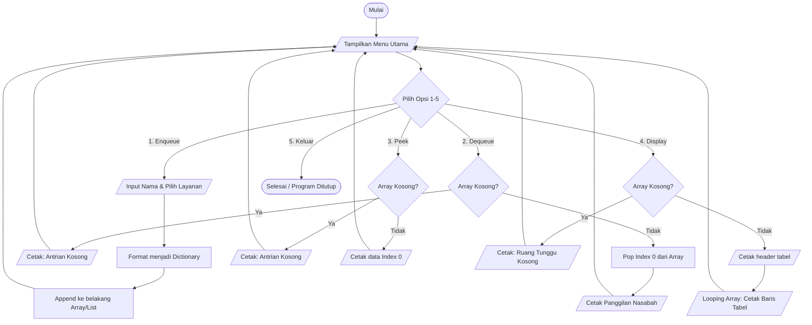

# PROJECT UTS STRUKTUR DATA : Sistem Antrian Customer Service Bank

**Mata Kuliah :** Struktur Data  
**Semester :** Genap 2025/2026  
**Jenis Tugas :** Project Kelompok  
**Tema :** Penerapan Queue Menggunakan Array  

### Identitas Kelompok  
*Tugas ini dikerjakan oleh :* 
1. **Nama :** I Putu Agus Adi Wiranata | **NIM :** [2501010068] | **Akun GitHub :** [@Wiranz]
2. **Nama :** I Putu Vivekananda Gosvami | **NIM :** [2501010350] | **Akun GitHub :** [@Vivekananda2501]
3. **Nama :** I Gede Arya Desta Adi Wiguna | **NIM :** [2501010083] | **Akun GitHub :** [@Adi4259j]

---

## 1. Rumusan Masalah dan Solusi

**Rumusan Masalah:**
Berdasarkan studi kasus sistem antrian pelayanan *Customer Service* (CS) di bank, rumusan masalah dalam proyek ini adalah :
1. Bagaimana konsep struktur data *Queue* dapat digunakan untuk mengelola antrian pelanggan bank dengan adil berdasarkan jenis layanannya?
2. Bagaimana implementasi menggunakan *Array* dapat meningkatkan efisiensi pendataan nasabah dibandingkan pencatatan manual?
3. Bagaimana sistem yang dibuat ini mampu menyelesaikan permasalahan nyata terkait penumpukan pelanggan di ruang tunggu bank?

**Solusi yang Ditawarkan:**
Solusi yang ditawarkan adalah sebuah program simulasi antrian digital berbasis antarmuka teks (CLI). Sistem ini menggunakan struktur data *Queue* dengan penyimpanan berbasis *Array* (*List* pada Python) untuk menampung data nama dan jenis keperluan nasabah secara dinamis. Sistem memastikan petugas CS memanggil nasabah murni berdasarkan urutan kedatangan pertama, sehingga memberikan transparansi tata urutan pelayanan di ruang tunggu bank.

---

## 2. Landasan Teori

Struktur data adalah sebuah metode atau cara sistematis untuk menyimpan, mengorganisasi, dan mengelola sekumpulan data di dalam ruang memori komputer. Tujuan utama dari penggunaan struktur data adalah agar operasi-operasi terhadap data tersebut—seperti pencarian, penyisipan, dan penghapusan—dapat dilakukan dengan seefisien mungkin dari segi waktu dan penggunaan memori. Pemilihan struktur data yang tepat merupakan fondasi krusial dalam pengembangan perangkat lunak yang andal.

Salah satu struktur data linier yang paling banyak dimanfaatkan untuk simulasi dunia nyata adalah *Queue* (Antrian). Secara konseptual, *Queue* beroperasi mutlak berdasarkan prinsip FIFO (*First In First Out*). Prinsip FIFO ini menetapkan bahwa elemen data yang pertama kali dimasukkan ke dalam antrian akan menjadi elemen pertama yang dikeluarkan atau diproses. Hal ini mereplikasi logika antrian manusia pada loket pelayanan, di mana asas keadilan ditegakkan dengan melayani mereka yang datang lebih awal.

Dalam praktiknya, implementasi *Queue* dapat diwujudkan menggunakan tipe struktur memori yang berurutan seperti *Array*. Implementasi dengan *Array* (direpresentasikan melalui objek *List* dinamis pada bahasa Python) memberikan keuntungan berupa alokasi memori yang kontinu sehingga elemen data dapat diakses dengan cepat. Dengan memanipulasi indeks *array*, kita dapat dengan mudah menambah data baru di indeks paling belakang maupun menghapus data yang telah diproses dari indeks terdepan.

**Sumber Ilmiah :**
1. Sjukani, M. (2014). *Struktur Data (Algoritma & Struktur Data 2) dengan C, C++*. Jakarta: Mitra Wacana Media. (Buku)
2. Kadir, A. (2013). *Teori dan Aplikasi Struktur Data Menggunakan C++*. Yogyakarta: Penerbit Andi. (Buku)
3. Fathoni, M., & Haryanto, D. (2019). "Implementasi Algoritma Antrian (Queue) pada Sistem Pelayanan Nasabah Bank". *Jurnal Komputasi dan Sistem Informasi*, 5(2), 112-118. (Jurnal Ilmiah)

---

## 3. Desain Sistem dan Implementasi

### Alur Sistem
Sistem ini memproses data dengan alur kerja berikut :
* **Input :** Pengguna berinteraksi dengan menu interaktif, memberikan masukan berupa teks "Nama Nasabah" dan memilih opsi huruf untuk "Jenis Layanan" (A/B/C).
* **Proses :** Sistem menyatukan data nama dan layanan menjadi sebuah objek *Dictionary*, lalu memasukkannya ke indeks akhir *Array* (*Enqueue*). Saat petugas memanggil antrian, data pada indeks ke-0 dihapus dari *Array* (*Dequeue*). Sistem juga bisa membaca data terdepan tanpa menghapusnya (*Peek*) dan melakukan iterasi pada *Array* untuk memformat data sebagai tabel cetak (*Display*).
* **Output :** Cetakan informasi di terminal yang interaktif, notifikasi tiket antrian berhasil dibuat, teks panggilan nasabah ke loket, serta tampilan keseluruhan tabel antrian ruang tunggu.

### Flowchart Sistem

---

## 4. Kesimpulan

Berdasarkan perancangan dan implementasi yang telah dilakukan, ditarik kesimpulan untuk menjawab rubrik penilaian sebagai berikut:

1. Apakah rumusan masalah telah terselesaikan? Ya, seluruh rumusan masalah terkait pengelolaan antrian nasabah berhasil teratasi. Implementasi menggunakan tipe Array yang dipadukan dengan struktur data Dictionary sangat sukses memberikan fleksibilitas untuk mendata nama nasabah dan jenis layanan sekaligus tanpa pencatatan manual yang rentan hilang.

2. Apakah sistem berjalan sesuai teori? Ya, sistem ini berjalan 100% mematuhi prinsip teori struktur data FIFO (First In First Out). Penggunaan algoritma manipulasi array pop(0) secara murni pada fungsi dequeue() menjamin tidak ada tumpang tindih urutan; nasabah yang mengambil tiket paling awal akan terhapus dan terlayani lebih dulu.

3. Bagaimana manfaat Queue pada kasus tersebut? Pada kasus nyata di loket Customer Service bank, penggunaan struktur data Queue memberikan manfaat vital dalam menertibkan ruang tunggu dan memberikan transparansi urutan (melalui fungsi display()). Hal ini mencegah kebingungan, menghindari konflik antar nasabah yang berebut giliran, dan membantu CS memonitor beban kerja secara interaktif.

## 5. Power Point Presentasi
https://canva.link/jqtwkl91fxein8z
